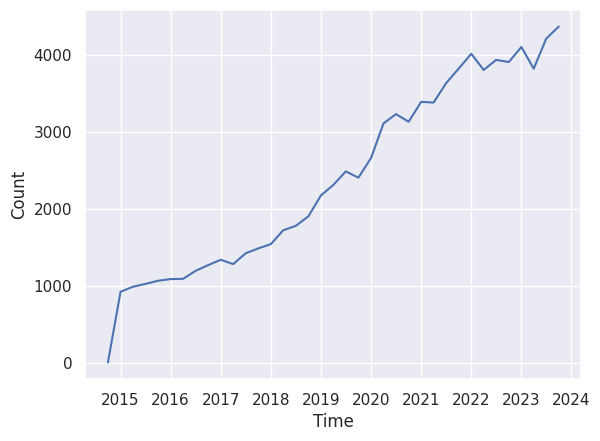
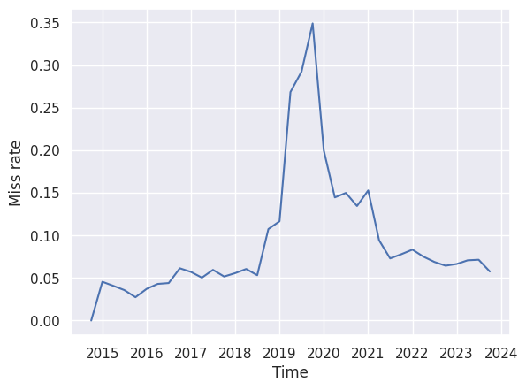

We get our data by randomly sampling comments from Reddit. To do this, we randomly generate and request comment IDs (e.g. `t1_d123abc`). Some of these IDs correspond to comments that are deleted or in private subreddits, and so we get nothing back for these IDs. We do get back comments for most IDs, but we saw that around 2019/2020, there was a significant spike in the number of inaccessible comments.

We believe it was caused by the banning of a massive number of subreddits in 2020. This blog post will go over how we found the anomaly and what we will be doing to account for it.

## Finding the anomaly

When we started trying out Reddit's API, we simply generated comments between two IDs, one corresponding to a comment at the beginning of our time range and the other corresponding to a comment at the end of our time range. At the time, we had to find these comments manually, though we now have a script to do it automatically.

The below code uses this approach to obtain a list of IDs for successfully requested comment and a corresponding list of their timestamps. It also creates a list of IDs for inaccessible comments.

```python
from datetime import datetime
import numpy as np

first_id = int("cnas8zz", 36) # ID of comment from 2015-01-01 00:00:00+00:00
last_id = int("kfrowyo", 36) # ID of comment from 2024-01-01 00:00:00+00:00

ids: list[int] = []
times: list[datetime] = []
misses: list[int] = []

for _ in range(1000):
    rand_ids = np.random.randint(first_id, last_id, size=100)
    fullnames = [f"t1_{np.base_repr(id, 36).lower()}" for id in rand_ids]
    possible_misses = set(rand_ids)
    for comment in reddit.info(fullnames=fullnames):
        id = int(comment.id, 36)
        ids.append(id)
        times.append(datetime.fromtimestamp(comment.created_utc))
        possible_misses.remove(id)
    misses.extend(possible_misses)
```

Let's see the distribution of the timestamps of these comments. We can aggregate in 3-month chunks and then see how many comments we got from each 3-month-long time period.

```python
import polars as pl
import seaborn as sns

df = pl.DataFrame({"id": ids, "Time": times})
df = df.sort(by="Time")
time_groups = df.group_by_dynamic("Time", every="3mo")
sns.lineplot(
    data=time_groups.agg(Count=pl.len()),
    x="Time",
    y="Count",
)
```

No surprises here. The number of comments is increasing over time, which is to be expected, given that Reddit's popularity has increased over time.



But we also wanted to know how many of our requests were failing, because at the time, we weren't sure if the generate-an-ID-and-hope-it-exists approach was viable. So we calculated this miss rate by taking the number of misses between the start and end ID of each of the 3-month time periods created above and dividing it by the total number of comments requested in that period.

```python
with_bounds = time_groups.agg(
    start=pl.col("id").min(),
    end=pl.col("id").max(),
    hits=pl.len(),
)

def miss_rate(row):
    _, start_id, end_id, num_hits = row
    num_misses = len([miss for miss in misses if start_id < miss < end_id])
    return num_misses / (num_hits + num_misses) if num_misses else 0.0

sns.lineplot(
    data=with_bounds.with_columns(with_bounds.map_rows(miss_rate)).rename(
        {"map": "Miss rate"}
    ),
    x="Time",
    y="Miss rate",
)
```

It's true that this will slightly undercount the number of misses in each time period. We've since figured out how to fix that, but as you can see below, the anomaly is apparent even with this imperfect calculation. There is a very noticeable spike in the miss rate around 2019/2020. It starts off well under 0.1, and at some point in 2018, it starts increasing, shooting up to around 0.35 before settling back down around 2021.



## The Great Ban

The reason for this spike is probably "The Great Ban." A former team member found that in 2020, around 2000 subreddits were banned in order to make Reddit a safer, more inclusive space [^great_ban].

Many of these subreddits were quite popular, such as r/ChapoTrapHouse and r/The_Donald. r/ChapoTrapHouse was a far left subreddit that appears to have been banned because it advocated for violence against conservatives [^out_of_the_loop_chapo]. r/The_Donald was a right-wing subreddit that was banned because, among other reasons, it hosted racist, anti-Semitic, and Islamophobic content [^donald_chapo_banned], as well as Russian election disinformation [^history_of_donald]. It appears that after years of analysis, Reddit discovered that subreddits dedicated to racism, sexism, anti-Semitism, transphobia, glorification of violence, and so on were often filled with racism, sexism, anti-Semitism, transphobia, glorification of violence, and so on.

When these subreddits were banned, their comments became inaccessible through Reddit's API. For us, this means that a great many IDs around 2018-2021, when requested, will not return anything because they belong to comments from these banned subreddits. This explains why our miss rate was so much higher around 2019-2020.

After 2020, Reddit seems to have eased off on banning subreddits. Although they did ban thrice as many subreddits in 2021 as they did in 2020, most of these bans were for unmoderated subreddits [^transparency_2021]. There was a decrease in subreddit bans for hateful content and harrassment. This explains why the miss rate came back down in 2021.

It looks like most of these banned subreddits were not particularly particular until around 2019, which explains why the miss rate only started spiking around 2019. We can observe this using [Subreddit Stats](https://subredditstats.com). As some cherry-picked examples, take r/ChapoTrapHouse, r/DarkHumorAndMemes, r/GenderCritical, r/soyboys, and r/wojak. Although Subreddit Stats doesn't show comment data before 2019, it does show the number of subscribers to each subreddit over time. In terms of subscribers, all of these subreddits didn't really take off until around 2019, even though most of them were created well before then. Presumably, many/most of the comments in these subreddits were also posted around 2019.

The users in these subreddits are another thing to consider. 15.6% of users from banned subreddits left Reddit after the ban [^great_ban], and these users may have mass-deleted their most recent comments in protest before leaving. This would again contribute to a higher miss rate around 2018-2021. This is just a theory, however.

Ultimately, the cause of the anomaly isn't as important as how we handle it.

## Dealing with the anomaly

We haven't actually figured out yet exactly how we will sample comments.

We'll be splitting up the entire time range under study (around 2010-2023) into time periods of a few months. The simplest method would be to sample the same number of comments from each time period, e.g. 100 comments from January-March 2010, 100 from April-June 2010, and so on. This accounts for deleted comments but assumes the Internet as a whole hasn't grown significantly over the years, even if Reddit has. But this is not an assumption we can make.

Another approach we can take is to assume that the popularity of the Internet is tied to the popularity of Reddit. This way, rather than sampling the same number of comments from each time period, we can sample the same percent of IDs from each time period. Note that this considers the total number of IDs in a time period, not the number of undeleted comments. This would again account for deleted comments.

Lastly, a complicated approach we can take would involve quantifying how popular the Internet and Reddit are. When deciding the number of comments to get from each time period, we would account for what portion of the Internet is made up by Reddit.

## References

[^great_ban]: https://arxiv.org/abs/2401.11254v1
[^out_of_the_loop_chapo]: https://www.reddit.com/r/OutOfTheLoop/comments/bp7w6p/
[^donald_chapo_banned]: https://web.archive.org/web/20201118112258/https://www.theatlantic.com/technology/archive/2020/06/reddit-ban-the-donald-chapo-content-policy/613639
[^history_of_donald]: https://web.archive.org/web/20201108095845/https://www.fastcompany.com/90244757/the-inside-story-of-reddits-struggle-to-deal-with-its-most-toxic-pro-trump-users
[^transparency_2021]: https://redditinc.com/policies/transparency-report-2021-2
